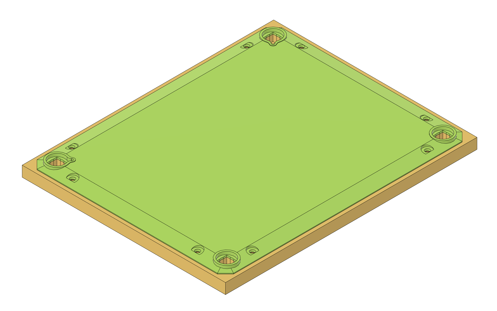

# Steam Machine faceplate CAD files modified from Valve's Inkterface E-ink faceplate models

Inkterface original files:
<https://gitlab.steamos.cloud/SteamHardware/SteamMachine/inkterface>

Mockup CAD files modified from Inkterface CAD files while waiting for official models to be released.

## Notes
Not tested yet, but as they are modified from official files, they should be quite accurate.

TODO 1: magnet holes need work to fit some basic magnets.
TODO 2: faceplate thickness not verified, the E-ink faceplate seems slightly thicker than the normal, judging by the photos.

## Files

Faceplate itself:
steam_machine_-_faceplate_1.step

Backplate with alignment holes:
steam_machine_-_backplate_1.step

Both files combined if you just want a full size reference:
steam_machine_-_faceplate_combined_1.step

## License

This project is licensed under the MIT License, see LICENSE.
